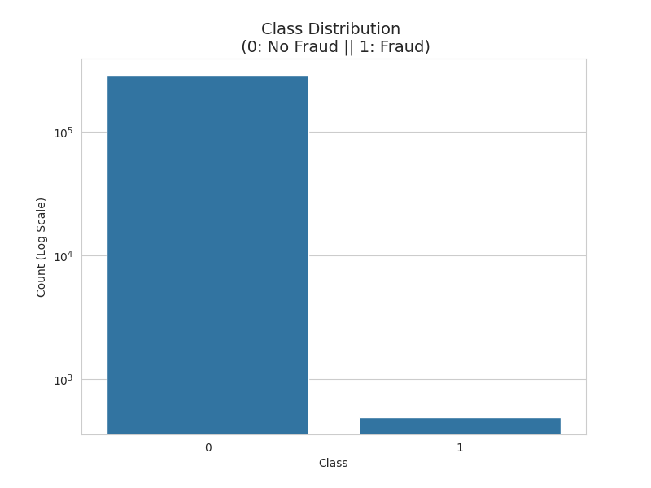
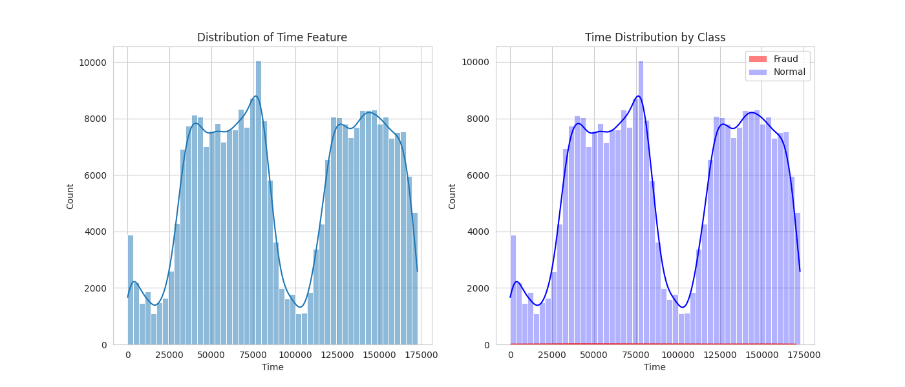
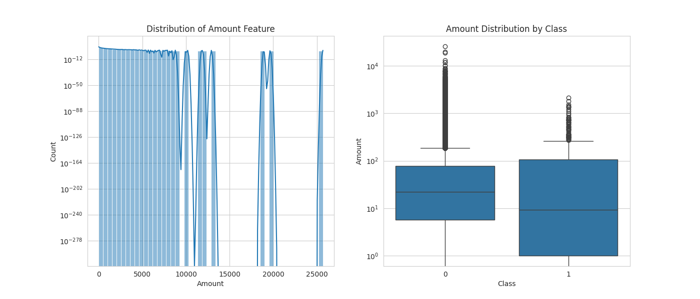
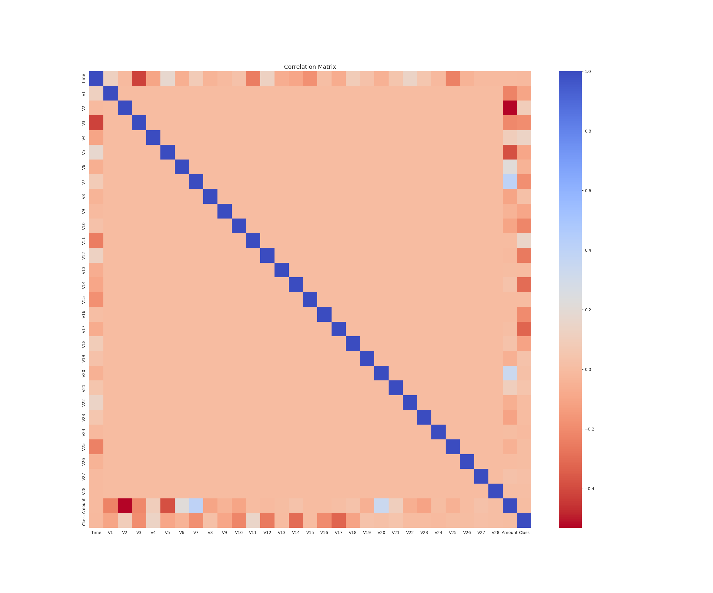
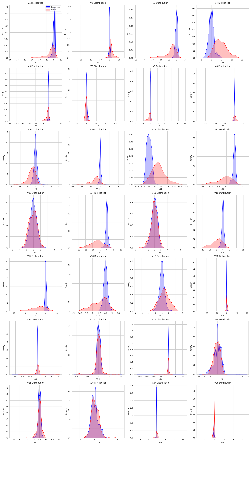

# Exploratory Data Analysis Report

## Overview
This report summarizes the findings from the Exploratory Data Analysis (EDA) performed on the Credit Card Fraud Detection dataset.

## 1. Class Distribution
The dataset is highly imbalanced, which is typical for fraud detection.
- **Legitimate Transactions (Class 0)**: ~99.83%
- **Fraudulent Transactions (Class 1)**: ~0.17%

> [!NOTE]
> The extreme imbalance necessitates the use of metrics like PR-AUC and techniques like class weighting (scale_pos_weight) during training.

## 2. Time and Amount Analysis

### Time
- The `Time` feature shows the seconds elapsed since the first transaction.
- There are cyclical patterns in the data (likely day/night cycles).
- Fraudulent transactions seem to occur more uniformly or at different rates compared to legitimate ones, but the distinction is not very sharp.

### Amount
- Most transactions are of low value.
- Fraudulent transactions tend to be smaller in amount compared to the maximum legitimate transactions, but there are some high-value frauds.
- The distribution is right-skewed (heavy tail).

## 3. Feature Correlations
- The V1-V28 features are Principal Components (PCA), so they are orthogonal and uncorrelated with each other by design.
- However, some features show correlation with `Time`, `Amount`, and `Class`.
- **Negative Correlation with Class**: V14, V17, V12 (Lower values indicate higher fraud probability).
- **Positive Correlation with Class**: V11, V4 (Higher values indicate higher fraud probability).

## 4. Feature Distributions (Fraud vs. Legitimate)
Comparing the distributions of V-features for both classes reveals which features are most discriminative.

- **Highly Discriminative Features**: V14, V12, V17, V10, V4, V11.
    - These features show significantly different distributions for Fraud vs. Legitimate transactions.
- **Less Discriminative Features**: V13, V15, V22, V25.
    - The distributions overlap significantly.

## Conclusion
1.  **Imbalance**: The dataset requires careful handling of class imbalance.
2.  **Scaling**: `Time` and `Amount` need scaling (StandardScaler) as they are on different scales than V1-V28.
3.  **Feature Selection**: While XGBoost handles feature selection well, features like V14, V17, and V12 are likely to be the most important predictors.
